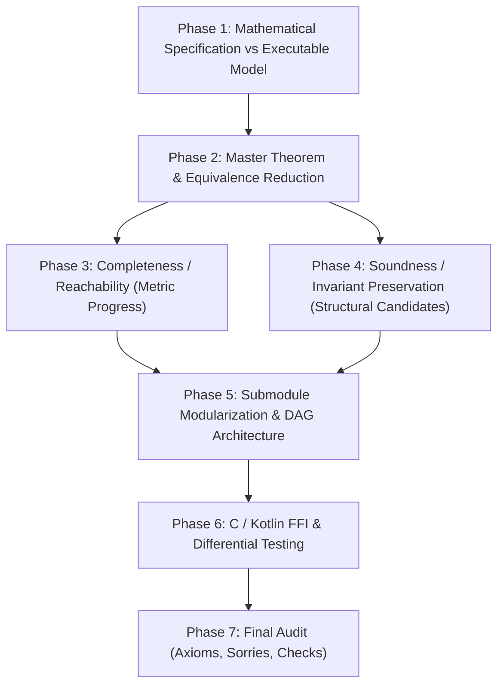

# Formally Verify Skill

Use this skill when formally verifying an algorithm, data structure, or mathematical property in the **ComposeLife** codebase using Lean 4 and Mathlib.

The repository pairs Kotlin Multiplatform implementations with formal Lean 4 models, connected via C FFI bridges (and Kotlin/Native cinterop) for runtime validation and differential conformance testing.

---

## 🎯 Verification Criteria (Definition of Done)

A verification task is only complete when:
1. **The Target Theorem is Proven in its Unmodified Form**: The master theorem statement matches the specification without introducing artificial preconditions or weakening the theorem's guarantees.
2. **Zero `sorry`s**: No `sorry`s anywhere in tracked project files.
3. **Zero Custom Axioms**: The theorem must depend strictly on the standard Lean 4 core axioms:
   ```lean
   [propext, Classical.choice, Quot.sound]
   ```
   No custom `axiom` declarations or unverified assumptions.
4. **Clean Compilation**: `lake build <Target>:static` succeeds with **0 warnings and 0 errors**.
5. **Differential & Conformance Tests Pass**: All Kotlin/Native bridge tests and randomized fuzz tests pass cleanly via Gradle (`./gradlew :<module>:check`).

---

## 🏛️ Architecture & Workflow

Formal verification follows a 6-phase lifecycle:



---

## 📋 Step-by-Step Guide

### Phase 1: Mathematical Specification vs Executable Model
1. **Define the Ground Truth Specification**:
   - Model the mathematical truth declaratively (e.g. relations, set comprehension, inductive predicates, or closed-form expressions).
   - Use exact, uncompromised mathematical types (such as `Nat`, `Int`, `Rat`, or inductive structures) rather than lossy representations to avoid rounding errors and floating-point ambiguity.
2. **Define the Executable Algorithmic Model**:
   - Model the algorithm as it executes in practice (e.g. step functions, recursors, loop iterations, or state machines).
   - Ensure the algorithmic model matches the design intended for production code in Kotlin.

---

### Phase 2: Master Theorem & Equivalence Reduction
1. **State the Master Theorem**:
   ```lean
   theorem algorithm_correctness (inputs : InputType) :
       algorithmExecutable inputs ↔ SpecificationPredicate inputs
   ```
2. **Prove a Reduction Lemma Early**:
   - Factor out trivial edge cases (e.g. empty collections, identity inputs, degenerate bounds) into base lemmas.
   - Separate the equivalence into two independent directions:
     - **Completeness (No False Negatives)**: Every element or state satisfying the specification is produced or reached by the algorithm.
     - **Soundness (No False Positives)**: Every element or state produced by the algorithm satisfies the specification.

---

### Phase 3: Proving Completeness (Progress & Reachability)
1. **Construct a Strictly Monotonic Progress Metric**:
   - When an algorithm iterates or steps toward a goal state, avoid inducting directly on complex multidimensional structures.
   - Construct a non-negative progress metric $D : \text{State} \to \mathbb{N}$ that measures distance to completion or target state.
2. **Prove Abstract Reachability**:
   - Prove that for every non-terminal state $s$ with $D(s) > 0$:
     - The step does not prematurely terminate.
     - The next state either achieves the goal or strictly decreases the metric: $D(\text{step}(s)) < D(s)$.
3. **Bound the Fuel / Iteration Budget**:
   - Prove by well-founded induction on $D(s)$ (or natural number induction on fuel) that any initial budget $\text{fuel} \ge D(s_0)$ guarantees reaching the target state without skipping.

---

### Phase 4: Proving Soundness & Avoiding Timeouts
1. **Formulate Inductive Invariants**:
   - Define an invariant predicate $I(s)$ that holds on the initial state $s_0$ and implies the desired postcondition at termination.
   - Prove step preservation: $I(s) \implies I(\text{step}(s))$.
2. **Prevent Combinatorial State Explosion (Deterministic Timeouts)**:
   > [!CAUTION]
   > Never unfold recursive functions with complex nested conditionals directly inside arithmetic goals or heavy automation (`simp`, `split_ifs`, `whnf`). This causes exponential branch blowup and deterministic timeouts.
3. **The Structural Candidate Lemma Pattern**:
   - Encapsulate the finite transition possibilities of the step function into a simple membership lemma:
     ```lean
     theorem step_candidates (s : State) :
         step s ∈ [candidate₁ s, candidate₂ s, ..., candidateₖ s]
     ```
   - Case split on the finite list of candidates rather than destructing internal condition trees.
4. **Domain Partitioning**:
   - When conditions involve directional signs or inequalities, partition the input domain into disjoint regions where sign variables are fixed.
   - In fixed-sign subdomains, denominators do not change sign, and linear arithmetic (`linarith`), normalization (`ring`), and positivity (`positivity`) tactics can resolve goals in constant time without branching.

---

### Phase 5: Submodule Modularization & Clean File Organization
When a verification file exceeds 1,500–2,000 lines, split it into a clean Directed Acyclic Graph (DAG) of submodules:

- **`Specification.lean` / `Types.lean`**: Domain types, predicates, and declarative specifications.
- **`Step.lean` / `Model.lean`**: Executable transitions, structural candidate lemmas, and directional properties.
- **`Completeness.lean`**: Progress metric definition, distance descent lemmas, and reachability theorems.
- **`Soundness.lean`**: Invariant preservation across partitioned domains and soundness induction.
- **`Properties.lean`**: High-level module importing submodules and stating the master correctness theorems.

> [!IMPORTANT]
> - Ensure **every `.lean` file** begins with the Apache 2.0 license header from `config/license.template`.
> - Modularization enables Lake to compile submodules in parallel, cutting build times and preventing editor lockups.
> - Remove all leftover exploratory duplicate theorems (e.g. `*_dup`).

---

### Phase 6: C / Kotlin FFI & Differential Conformance Testing
1. **Lossless Type Marshaling**:
   - Connect the Lean model to Kotlin via C ABI bindings.
   - When converting between Kotlin primitives (e.g. IEEE-754 floats) and exact mathematical models (e.g. dyadic rationals `Rat`):
     - Unpack binary representations faithfully (e.g. evaluating sign, exponent, and fraction bitfields) to preserve exact numerical values.
     - Never cast raw bit patterns directly into integer values.
2. **Memory & Runtime Safety**:
   - Ensure Lean runtime initialization (`lean_initialize_runtime_module`) is called once.
   - Correctly manage Lean reference counting (`lean_dec_ref`, `lean_alloc_array`, `lean_box_*`, `lean_unbox_*`).
3. **Differential Fuzz Testing**:
   - In Kotlin tests, write randomized property-based tests running hundreds of iterations comparing Kotlin implementations against the Lean oracle:
     ```kotlin
     assertEquals(oracle.compute(inputs), kotlinImplementation(inputs))
     ```
4. **Gradle Native Cache Invalidation**:
   - When modifying C or Lean native static libraries, rerun native test binaries with `--no-build-cache --rerun-tasks` to ensure the linker doesn't reuse stale executables.

---

## 🔍 Verification Commands & Audit Checklist

Execute these exact verification checks before concluding any formal verification task:

```bash
# 1. Clean Lake build (must compile with 0 warnings, 0 errors)
cd <path-to-lean-module>
lake clean && lake build <Target>:static

# 2. Axioms verification (must only report [propext, Classical.choice, Quot.sound])
lake env lean --run - << 'EOF'
import <Module>.Properties
#print axioms <Module>.<MasterTheorem>
EOF

# 3. Check for any sorrys in the codebase (must return 0 results)
grep -rn "sorry" <path-to-lean-module>/

# 4. Check for any custom axioms (must return 0 results)
grep -rn "axiom" <path-to-lean-module>/

# 5. Run full Gradle checks, conformance tests, and Detekt inspections
cd <project-root>
./gradlew :<module>:check --no-build-cache
```

---

## 💡 Practical Proof Tactics Reference

| Tactic | Best Used For |
| :--- | :--- |
| `omega` | Natural number and integer linear arithmetic, modulo arithmetic, Presburger constraints, fuel bounds. |
| `linarith` | Linear real, rational, or ordered field inequalities with hypotheses. |
| `ring` | Ring equalities on algebraic structures (expanding polynomials, verifying common denominators). |
| `positivity` | Automatically discharging strict positivity ($> 0$), non-negativity ($\ge 0$), or non-zero ($\ne 0$) goals. |
| `rcases` / `obtain` | Destructing existential hypotheses (`∃ x, ...`) and conjunctions without deeply nested indentation. |
| `split_ifs with h` | Splitting conditional expressions while retaining the condition hypothesis $h$. |
| `aesop` | Automated proof search for propositional logic, set memberships, and basic structural goals. |
