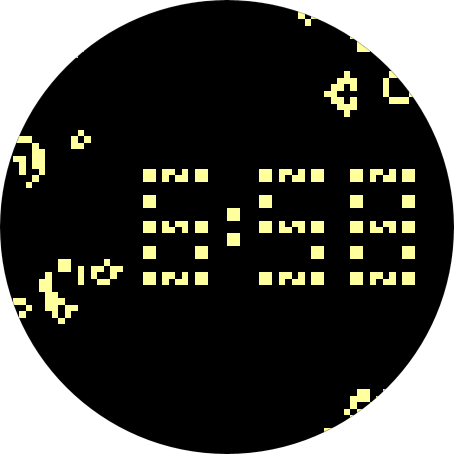

[](https://codecov.io/gh/alexvanyo/composelife)


# ComposeLife

**This is not an official Google product**

ComposeLife is a
work-in-progress [Game of Life](https://en.wikipedia.org/wiki/Conway%27s_Game_of_Life) simulator
Android app.

This project is a personal sandbox of sorts, experimenting with the latest libraries and tools.
These include:

- Written in [Kotlin](https://kotlinlang.org/)
- UI written in [Jetpack Compose](https://developer.android.com/jetpack/compose)
- Watchface for Wear OS with configuration
- Dependency injection using [Hilt](https://dagger.dev/hilt/) and [context receivers](https://github.com/Kotlin/KEEP/blob/master/proposals/context-receivers.md)
- [AGSL](https://developer.android.com/develop/ui/views/graphics/agsl) and [OpenGL](https://developer.android.com/develop/ui/views/graphics/opengl/about-opengl) rendering
- Fully functional CI system with GitHub Actions with:
    - JVM tests
    - [Robolectric](http://robolectric.org/) tests
    - Integration tests (minification with the help of [Keeper](https://slackhq.github.io/keeper/), memory leak checking with [LeakCanary](https://square.github.io/leakcanary/))
    - Screenshot tests with [Paparazzi](https://cashapp.github.io/paparazzi/)
    - Linting, with android/lint and [detekt](https://detekt.dev/)
    - Code coverage with [JaCoCo](https://github.com/jacoco/jacoco) (reporting done with [Codecov](https://about.codecov.io/))
    - Automatic dependency updates with [Renovate](https://docs.renovatebot.com/)
    - Automatic [baseline profile](https://developer.android.com/topic/performance/baselineprofiles) generation

## Setup

Requirements:

- Android Studio Flamingo Beta 4
- JDK 17+

Clone the project, and build! (no API keys or other setup necessary)

## Runnable Modules

[app](app) contains the mobile app simulator for running, editing, and exploring Game of Life
patterns.

[wear](wear) contains a Game of Life watchface, with a stable pattern displaying the time with a
surrounding random soup potentially destroying it while the watchface is active.



## License

```
Copyright 2022 The Android Open Source Project

Licensed under the Apache License, Version 2.0 (the "License");
you may not use this file except in compliance with the License.
You may obtain a copy of the License at

    https://www.apache.org/licenses/LICENSE-2.0

Unless required by applicable law or agreed to in writing, software
distributed under the License is distributed on an "AS IS" BASIS,
WITHOUT WARRANTIES OR CONDITIONS OF ANY KIND, either express or implied.
See the License for the specific language governing permissions and
limitations under the License.
```
